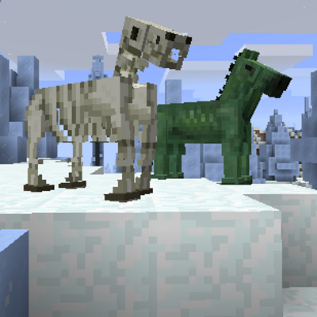

<h1 align="center">HorseFood [1.7.10 Only]</h1>

A Minecraft mod that adds new carrots that can upgrade and change your horses. Allows access to the Zombie Horse and Skeleton Horse entities that are already in the vanilla game, but not accessible.

### Emerald Carrot
* Cycles through the horses type (normal, zombie, skeleton).

### Lapis Carrot
* Cycles through the horses colors and patterns.

### Diamond Carrot
* Adds one heart of health to the horse.

### Redstone Carrot
* Increases the horses speed.

### Ender Carrot
* Increases the horse jump height.

There is a config file called "samshorsefood.cfg" that will let you control the horses maximum health, jump, and speed values.

## Credits
* Lothrazar (Original Creator of 1.8+ versions found [here](https://www.curseforge.com/minecraft/mc-mods/horse-upgrades))
* BJTMastermind (1.7.10 Backporter)
